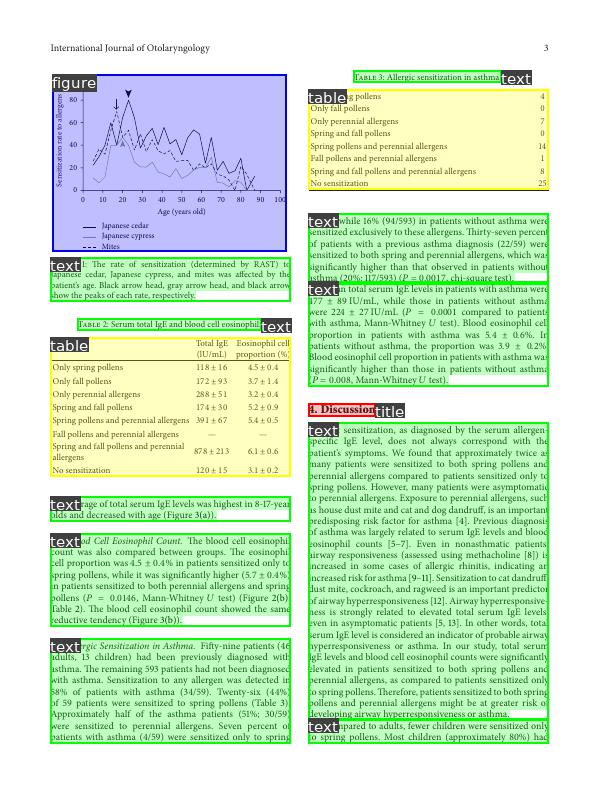
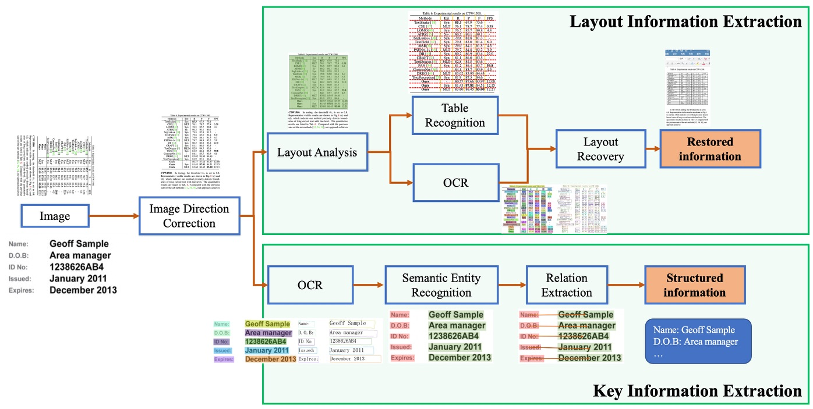

# PaddleProject

## resources

[PaddleOCR](https://github.com/PaddlePaddle/PaddleOCR)
[Ebook // Dive Into OCR pdf](https://paddleocr.bj.bcebos.com/ebook/Dive_into_OCR.pdf)
[Google Colab Implementation // youtube](https://colab.research.google.com/drive/1Xsjlbd3Kiqwu-_h-Y--gSCLHMSh0yg2w?usp=sharing#scrollTo=YG8Q1APRR7ZX)
[Start Learning OCR Ten Talks](https://aistudio.baidu.com/aistudio/course/introduce/25207) - they have a course all in chinese that you can ez sign up for.

Reading their `Dive into OCR book`
come to realize a few points.

## PP-OCR

- detection
- recognition
- e2e - end to end

## PP-Structure

- Key Information Extraction
- Semantic Entity Recognition
- Layout Analysis
- Table Analysis

There was a need for **Structured Information Extraction**

### Layout Analysis

Layout analysis is made to classify the content of document images into categories:

- plain texts,
- titles,
- tables,
- pictures,

etc. Current methods generally detect or segment them respectively.

  

### Table Recognition
> Table recognition is to identify and transfer the table information of the document into an excel file.

table -> excel

### KIE (Key Information Extraction)
KIE is important for Document VQA (Visual Question Answering)
- answering questions based on the visuals, almost auto answering.
> Q. What is the title of this book?
> A. Vermont Beautiful
above example.
well established computer vision problem.

KEI -> SER (Semantic Entity Research) and RE (Relation Extraction)

SER
- divides entity into black + red boxes for identification

RE
- categorizes text into questions and answers and then classifies corresponding answer for each question

general KIE method is called **Named Entity Relation** (NER)
but this only uses text information in the image without employing visual / structural information, therefore not so accurate this model.

due to fusing of multi-modal models (based)
- grid
- token
- e2e
- GCN

Relevant technologies of Document analysis will be demonstrated and practiced in **Chapter 6**.

Chapter Name - Document Analysis Technology

### Industrial Practice of OCR
pg 22

PP-OCR and  PP-STRUCTURE -> talks about what their model consists of, the genral structure

PP-OCR
- text detection
- detection frame correction
- text recognition (CRNN used) - Convolutional Recurrent Neural Network

## Document Analysis Technology

Direction
- **Layout analysis module**: It divides each document page into different content regions. This module can be used not
only to divide relevant and irrelevant regions, but also to classify the content it recognizes.

### Document VQA (8.1.3)
nvm it does explain certain parts of it, and there's some theory involved

[PP-Structure](https://github.com/PaddlePaddle/PaddleOCR/tree/release/2.6/ppstructure)
repository PP-structure division
[PP-structure technical details paper](https://arxiv.org/abs/2210.05391)

  

> Some tasks need to use both the structured analysis models and the OCR models

### Key Information Extraction (KIE)
[link](https://github.com/PaddlePaddle/PaddleOCR/tree/release/2.6/ppstructure/kie)

LayoutXLM

VI-LayoutXLM - which gets rid of visual features when finetuning the downstream tasks

> accuracy and inference speed of VI-LayoutXLM surpass those of LayoutXLM.

I feel like we technically don't need RE

> (1) Text detection + text recognition + semantic entity recognition (SER) + RE
>
no nvm we need RE

[how to do KIE](https://github.com/PaddlePaddle/PaddleOCR/blob/release/2.6/ppstructure/kie/how_to_do_kie_en.md#1-Introduction) - pipeline

[PPOCRLabelv2](https://github.com/PaddlePaddle/PaddleOCR/blob/release/2.6/PPOCRLabel/README.md) - key information annotation

KIE

now there's a new [inference document](https://github.com/PaddlePaddle/PaddleOCR/blob/release/2.6/ppstructure/docs/inference_en.md) for some reason.

This is **IMPORTANT**

idk if png jpg is the problem

the example image seems to be corrupt

Image Saved -> save_res_path : `./output/ser/xfund_zh/res`

the second half has SER inference