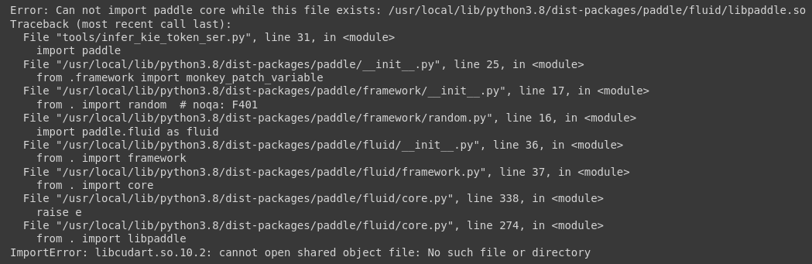

1. `train_data`
2. `pretrained_data`


### use OCR engine


```sh
python3 tools/infer_kie_token_ser.py \
  -c configs/kie/vi_layoutxlm/ser_vi_layoutxlm_xfund_zh.yml \
  -o Architecture.Backbone.checkpoints=./pretrained_model/ser_vi_layoutxlm_xfund_pretrained/best_accuracy \
  Global.infer_img=./ppstructure/docs/kie/input/zh_val_42.jpg
```
they want to me to use it on `zh_val_42.jp` which is in mandarin.


running 
```py
import paddle
paddle.utils.run_check()
```
gives that i have 2 working cpus

`pip install paddlepaddle`
`pip3 install paddlepaddle paddleocr`

lemme try install the gpu package
`pip install paddlepaddle-gpu`

libso error, for which I'm changing to venv version to a different python version


[recurring issue](https://github.com/PaddlePaddle/Paddle/issues/46377) 
on both google colab and local dev


1. okay
2. device_id
3. libso error


debugger
```sh
/usr/bin/env /home/axsae/Desktop/PaddleProject/venv_paddle/bin/python /home/axsae/.vscode/extensions/ms-python.python-2023.2.0/pythonFiles/lib/python/debugpy/adapter/../../debugpy/launcher 57971 -- /home/axsae/Desktop/PaddleProject/PaddleOCR/tools/infer_kie_token_ser.py \

-c configs/kie/vi_layoutxlm/ser_vi_layoutxlm_xfund_zh.yml \
  -o Architecture.Backbone.checkpoints=./pretrained_model/ser_vi_layoutxlm_xfund_pretrained/best_accuracy \
  Global.infer_img=./ppstructure/docs/kie/input/zh_val_42.jpg
```


to basically debug, I had to add this
```json
"args": [
        "-c",
        "configs/kie/vi_layoutxlm/ser_vi_layoutxlm_xfund_zh.yml",
        "-o",
        " Architecture.Backbone.checkpoints=./pretrained_model/ser_vi_layoutxlm_xfund_pretrained/best_accuracy",
        "Global.infer_img=./ppstructure/docs/kie/input/zh_val_42.jpg"
      ]
```

and this will auto add them in.


in the given demo, did you make sure the installed PaddlePaddle is supported with GPU
Please check it by the following codes

it shows only cpu

they want us to install `paddlepaddle-gpu` is a 500MB install.

the problem is still in
```py
import paddle
```

[libcudart.so issue](https://www.google.com/search?q=libcudart.so.10.2+cannot+open+shared+object&ei=MQD1Y6DPMqOKseMP-pms0AE&ved=0ahUKEwjgq-HRkqf9AhUjRWwGHfoMCxoQ4dUDCA8&uact=5&oq=libcudart.so.10.2+cannot+open+shared+object&gs_lcp=Cgxnd3Mtd2l6LXNlcnAQAzIFCAAQgAQyBggAEBYQHjIGCAAQFhAeMgYIABAWEB4yBQgAEIYDMgUIABCGAzIFCAAQhgM6CggAEEcQ1gQQsANKBAhBGABQtz5Y-VBguVRoAXABeACAAeABiAGlIZIBBjAuMjEuNZgBAKABAcgBCMABAQ&sclient=gws-wiz-serp)

okay idk what this is supposed to be.

gonna try and install cudatoolkit or something.


okay this is the file

> /venv_paddle/lib/python3.8/site-packages/paddle/fluid/core.py
this is what's trying to import that thingy.


  


**IMPORTANT**
[cannot open shared object file no such file or directory](https://github.com/open-mmlab/mmsegmentation/issues/943)

extension

[CUDA mismatch](https://stackoverflow.com/questions/55224016/importerror-libcublas-so-10-0-cannot-open-shared-object-file-no-such-file-or)
so we had to fix this shit.

had to install from [NVIDIA Cuda Toolkit 10.2](https://developer.nvidia.com/cuda-10.2-download-archive?target_os=Linux&target_arch=x86_64&target_distro=Ubuntu&target_version=1804&target_type=runfilelocal)

last attempt of the night to try and downgrade the so library file

cuDNN - cuda deep neural network library


trying out the PaddleOCRDemo

i got it working on google colab so that's that.

the error was a txt file.

`class_list_xfun.txt` apparently not found or something idk what the deal with that is supposed to be lol.

```sh
!python3 -m pip install "paddlepaddle-gpu==2.3.1"
!pip install "paddleocr==2.5.0.3"
```

with these 2 commands I can avoid the cuda issue I think? not too sure though.

> trying locally.


`PaddleOCR/train_data/X_FUND/class_list_xfun.txt`

`/home/axsae/Desktop/PaddleProject/PaddleOCR/ppocr/utils/dict/kie_dict/xfund_class_list.txt`


okay now can't load the other 2 paths for pretrained model

```sh
Traceback (most recent call last):
  File "./tools/infer_kie_token_ser_re.py", line 189, in <module>
    ser_re_engine = SerRePredictor(config, ser_config)
  File "./tools/infer_kie_token_ser_re.py", line 130, in __init__
    self.ser_engine = SerPredictor(ser_config)
  File "/content/PaddleOCR/tools/infer_kie_token_ser.py", line 68, in __init__
    self.model = build_model(config['Architecture'])
  File "/content/PaddleOCR/ppocr/modeling/architectures/__init__.py", line 30, in build_model
    arch = BaseModel(config)
  File "/content/PaddleOCR/ppocr/modeling/architectures/base_model.py", line 55, in __init__
    self.backbone = build_backbone(config["Backbone"], model_type)
  File "/content/PaddleOCR/ppocr/modeling/backbones/__init__.py", line 74, in build_backbone
    module_class = eval(module_name)(**config)
  File "/content/PaddleOCR/ppocr/modeling/backbones/vqa_layoutlm.py", line 149, in __init__
    super(LayoutXLMForSer, self).__init__(
  File "/content/PaddleOCR/ppocr/modeling/backbones/vqa_layoutlm.py", line 55, in __init__
    self.model = model_class.from_pretrained(checkpoints)
  File "/usr/local/lib/python3.8/dist-packages/paddlenlp/transformers/model_utils.py", line 555, in from_pretrained
    resolved_resource_files[file_id] = get_path_from_url_with_filelock(file_path, default_root)
  File "/usr/local/lib/python3.8/dist-packages/paddlenlp/utils/downloader.py", line 167, in get_path_from_url_with_filelock
    result = get_path_from_url(url=url, root_dir=root_dir, md5sum=md5sum, check_exist=check_exist)


  File "/usr/local/lib/python3.8/dist-packages/paddlenlp/utils/downloader.py", line 125, in get_path_from_url
    assert is_url(url), "downloading from {} not a url".format(url)
AssertionError: downloading from ./pretrained_model/ser_vi_layoutxlm_xfund_pretrained/best_accuracy/model_state.pdparams not a url
```


### 24th February 2023
either the JPEG is corrupt
or it just saves token and is done with everything.

> running cell SER + RE custom image